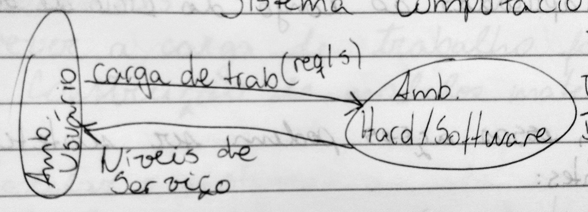
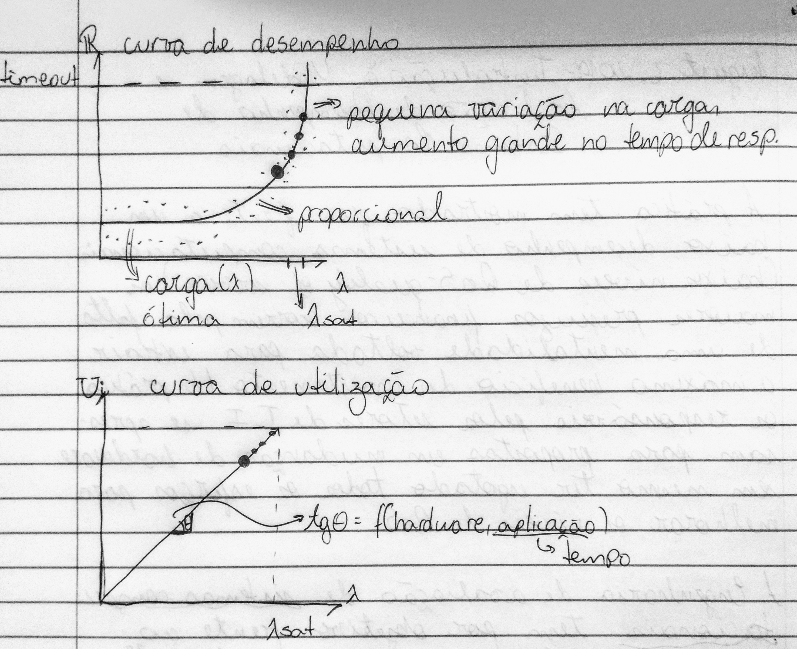
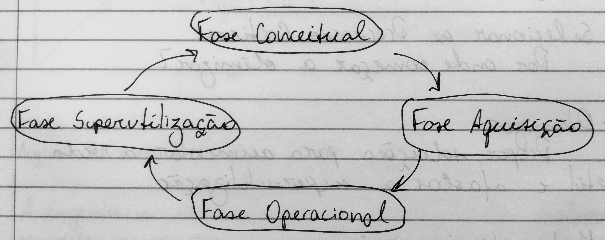
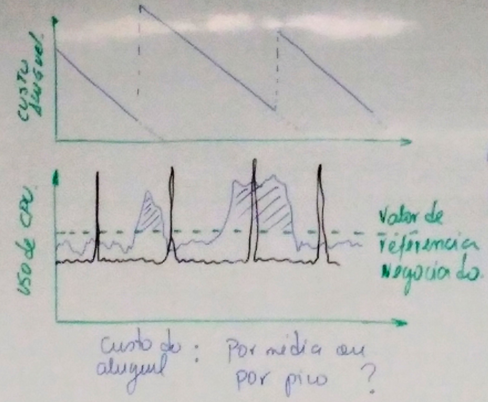
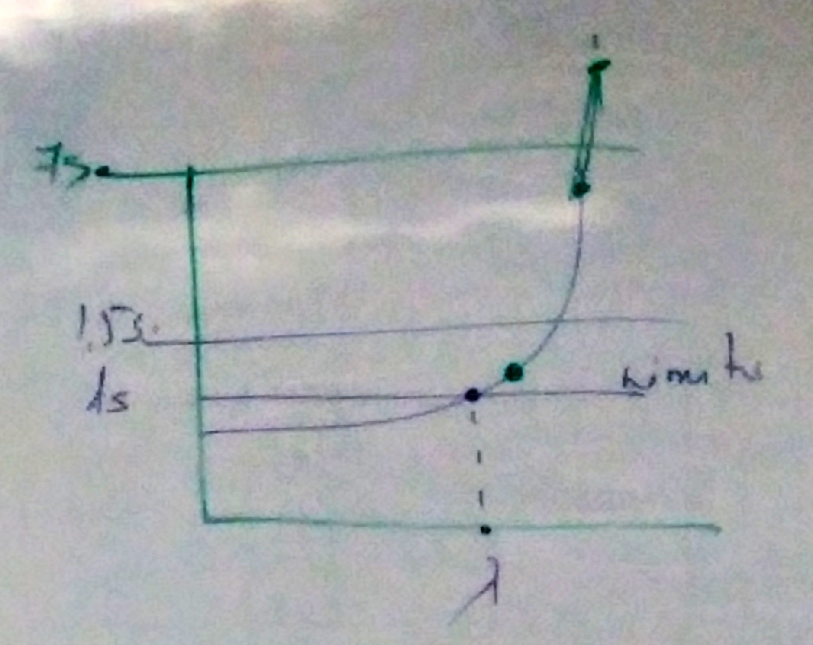
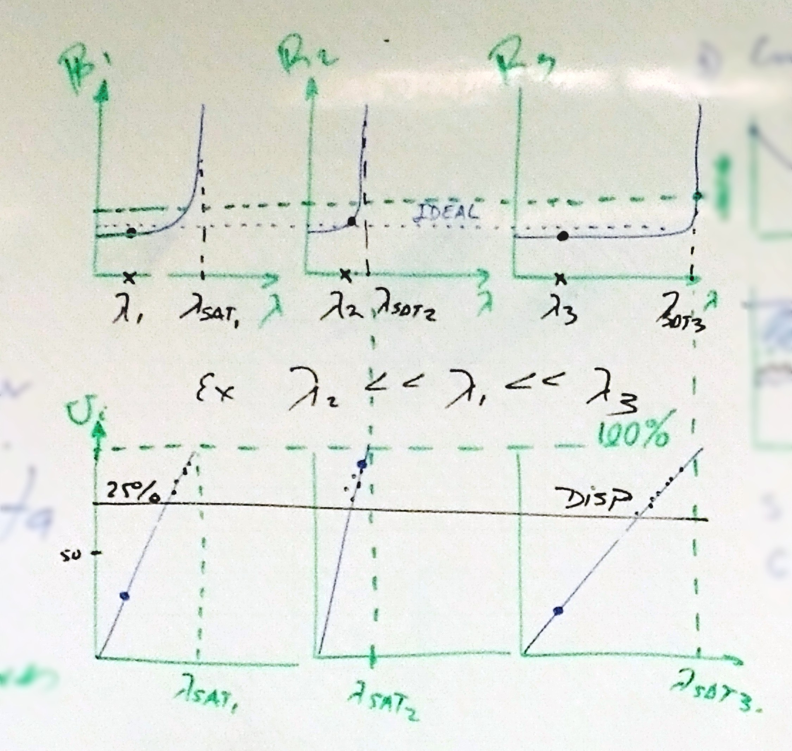
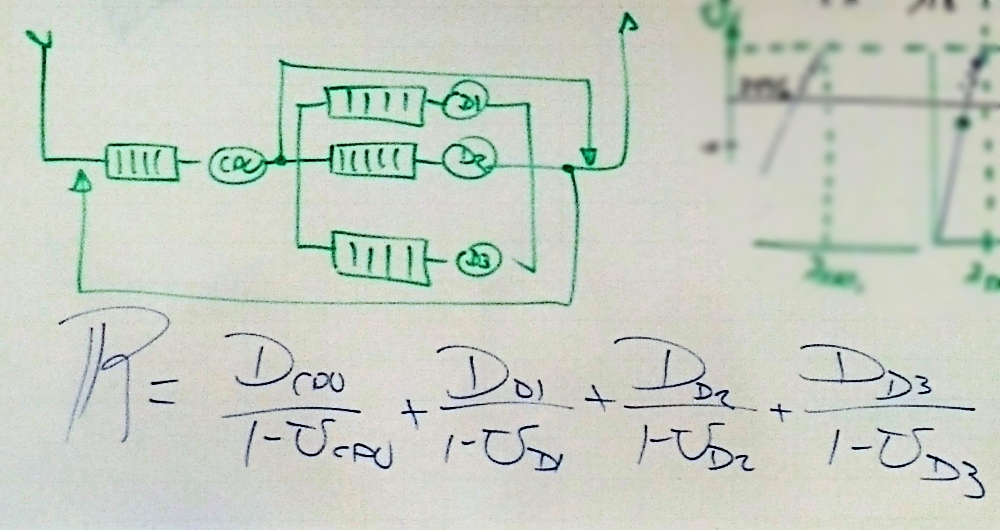
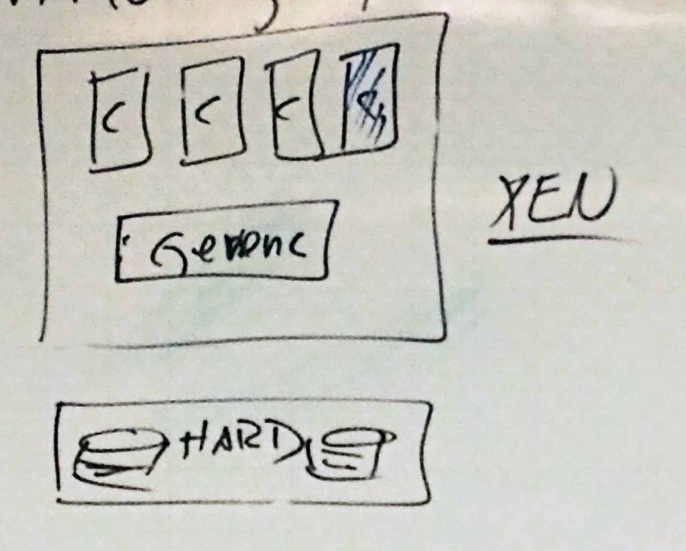
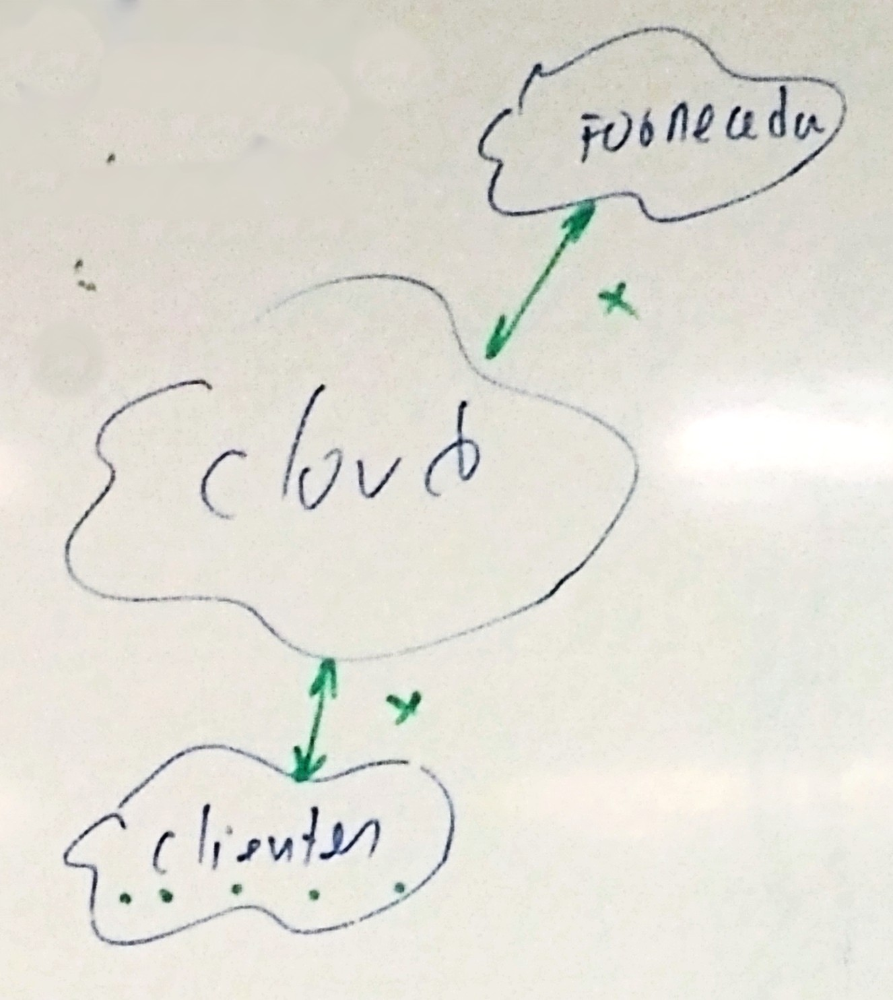

# Modelagem e avaliação de desempenho

> Agradecimentos ao [Felipe Megale](https://github.com/felipemegale) pelas imagens

## Introdução à modelagem e avaliação de desempenho de sistemas computacionais



A prática tem mostrado que frente a um baixo desempenho de sistemas computacionais (baixos níveis de QoS - Quality of Service) os maiores prejuízos financeiros ocorrem pela falta de uma mentalidade voltada para extrair o máximo benefício do investimento. Na prãtica, os responsáveis pelos setores de T.I. se apressam para propostas em mudanças de *hardware* sem mesmo ter esgotado todos os esforços para melhorar os níveis de QoS.



A Engenharia de Avaliação de Sistemas computacionais tem por objetivo, frente ao aumento contínuo da carga de trabalho, alimentar a vida útil do sistema, melhorando os níveis de serviço (R - tempo de resposta, U - utilização do sistema) dentro de limites normalmente estipulados pela gerência.

A engenharia de avaliação de desempenho de sistemas computacionais possui uma metodologia para o "planejamento de capacidade" a qual envolve uma série de etapas e ações, **corretivas** e **preventivas** que podem ser aplicadas ao longo do ciclo de vida do sistema.

Resumidamente essas ações podem ser sintetizadas nas seguintes:

* **Monitor:** Com quais dispositivos e durante quanto tempo?
* **Coletor:** Quais porâmetros observar objetivando a avaliação do sistema?
* **Sumarizar e identificar horãrios de pico**
* **Coletar novos dados:** Quais parâmetros coletar objetivando a otimização do sistema?
* **Selecionar os processos críticos:** Por onde começar a otimimza?
* **Otimizar:** Propor soluções para aumentar a vida útil e afastar a super-utilização
* **Meta-Otimização:** Tornar mais eficiente, provavelmente eficaz, o processo de otimização
* **Prever a carga de trabalho futuro:** Construção de modelos matemáticos
* **Modelar o sistema:** Construir modelos baseados na teoria das filas
* **Simular para prever o início da fase de super-utilização**
* **Configurar:** Propor configurações por meio de simulação
* **Negociar:** Fortes justificativas

### Ciclo de vida de um sistema computacional

Diferentemente ao ciclo de vida de um software, o ciclo de vida do sistema computacional não apresenta a "fase de morte". Qualquer mudança <u>parcial</u> ou <u>completa</u> da configuração de hardware é considerada evolução natural do sistema.



#### 1. Fase conceitual

Nesta fase, existe duas possíveis situações:

<ol type="a">
    <li>
        <b>Proposta da configuração inicial:</b> Para esta situação não existem técnicas altamente eficientes para configurar o hardware. As técnicas mais utilizadas são as técnicas Eu acho, Benchmark, Kernel.
    </li>
    <li>
        <b>Proposta de atualização deconfiguração existente:</b> Para esta situação existem técnicas mais elaboradas como a teoria das filas, simulação discreta, redes de petri, etc. Dentre estas a teoria das filas é mais aplicada para fins comerciais. Isso pelo tempo necessário para implementá-la.
    </li>
</ol>

#### 2. Fase de aquisição

Aparentemente esta fase parece transmitir uma impressão de simplicidade. Porém é exigido do responsável habilidades e estratégias de negociação e convencimento frente à diretoria e fornecedores. O resultado desta fase possui grandes implicações financeiras para a empresa. Isto torna-se mais sensível em ambientes onde predomina a compra de recursos e de sistemas _leasing_ (aluguel-venda). Neste último, existe maiores responsabilidade do responsável por acompanhar o desempenho do sistema.

Por exemplo, no sistema _leasing_:



Custo do aluguel: Por média ou por pico?

#### 3. Fase operacional

Espera-se que esta fase seja a mais longa de todas (2, 3 a 4 anos). Durante esta fase, o objetivo é extrair o máximo de proveito do investimento. Em outras palavras aumenta a vida últil do sistema, sem troca de configuração de _hardware_ (aumento de memória é permitido).



Durante a fase de operação são aplicadas as ações até a **Meta-otimização do sistema**. Ao final desta fase normalmente é realizada a previsão da carga de trabalho.

#### 4. Fase de super-utilização

Esta fase se caracteriza pelo fato da utilização do sistema estar em 100% de forma permanente. Esta fase deve ser previsa com 1 ano de antecedência. Na prática deve ser previsto com no mínimo 3 meses. Muitas vezes nos encontramos já na super-utilização.

### Aplicações da Metodologia para o planejamento de capacidade de sistemas computacionais

#### 1. Diagnóstico de servidores de aplicação

<table>
    <tr>
        <th></th>
        <th></th>
        <th>Antes</th>
        <th>Depois</th>
        <th></th>
    </tr>
    <tr>
        <td>🅧</td>
        <td><b>Memória (%)</b></td>
        <td>100</td>
        <td>98</td>
        <td></td>
    </tr>
    <tr>
        <td></td>
        <td><b>Paginação (%)</b></td>
        <td>35</td>
        <td>5</td>
        <td><i>Horário de pico<i></td>
    </tr>
    <tr>
        <td>🅧</td>
        <td><b>CPU (%)</b></td>
        <td>5</td>
        <td>5</td>
        <td></td>
    </tr>
</table>

#### 2. Previsão de desempenho de sistemas virtuais de aprendizado

Foram identificados: 80 requisições distintas
Modelos do sistema: 80 equações

Para simplificar o modelo:
* Eliminação de processos obsoletos e irrelevantes
* Redução de processos pela similaridade de características

**Exempo:**
```
Saldo Conta Corrente ≡ Saldo Polpança
Modelo resultante: 5 equações
```
#### 3. Em ambientes *leasing*


#### 4. Sistemas de balanceamento de carga


##### Critérios

1. Envia para o servidor com menor carga;
2. Tempo de resposta no instante `t`;
3. Utilização dos servidores;
4. Disponibilidade.



#### 5. Modelando internamente cada servidor

**Lei do fluxo forçado**



#### 6. Virtualização



#### 7. Nuvens

