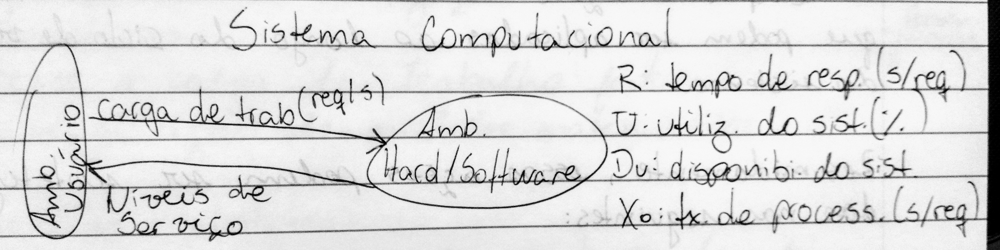
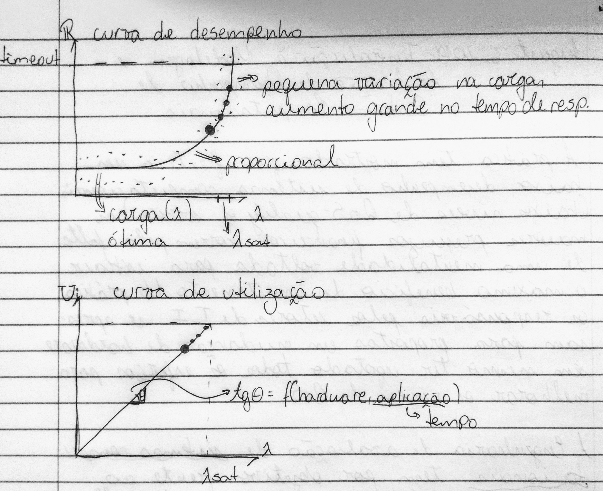

# Modelagem e avaliação de desempenho

> Agradecimentos ao [Felipe Megale](https://github.com/felipemegale) pelas imagens

## Introdução à modelagem e avaliação de desempenho de sistemas computacionais

A prática tem mostrado que frente a um baixo desempenho de sistemas computacionais (baixos níveis de QoS - Quality of Service) os maiores prejuízos financeiros ocorrem pela falta de uma mentalidade voltada para extrair o máximo benefício do investimento. Na prãtica, os responsáveis pelos setores de T.I. se apressam para propostas em mudanças de *hardware* sem mesmo ter esgotado todos os esforços para melhorar os níveis de QoS.

A Engenharia de Avaliação de Sistemas computacionais tem por objetivo, frente ao aumento contínuo da carga de trabalho, alimentar a vida útil do sistema, melhorando os níveis de serviço (R - tempo de resposta, U - utilização do sistema) dentro de limites normalmente estipulados pela gerência.

A engenharia de avaliação de desempenho de sistemas computacionais possui uma metodologia para o "planejamento de capacidade" a qual envolve uma série de etapas e ações, **corretivas** e **preventivas** que podem ser aplicadas ao longo do ciclo de vida do sistema.

Resumidamente essas ações podem ser sintetizadas nas seguintes:

* **Monitor:** Com quais dispositivos e durante quanto tempo?
* **Coletor:** Quais porâmetros observar objetivando a avaliação do sistema?
* **Sumarizar e identificar horãrios de pico**
* **Coletar novos dados:** Quais parâmetros coletar objetivando a otimização do sistema?
* **Selecionar os processos críticos:** Por onde começar a otimimza?
* **Otimizar:** Propor soluções para aumentar a vida útil e afastar a super-utilização
* **Meta-Otimização:** Tornar mais eficiente, provavelmente eficaz, o processo de otimização
* **Prever a carga de trabalho futuro:** Construção de modelos matemáticos
* **Modelar o sistema:** Construir modelos baseados na teoria das filas
* **Simular para prever o início da fase de super-utilização**
* **Configurar:** Propor configurações por meio de simulação
* **Negociar:** Fortes justificativas

### Ciclo de vida de um sistema computacional

Diferentemente ao ciclo de vida de um software, o ciclo de vida do sistema computacional não apresenta a "fase de morte". Qualquer mudança <u>parcial</u> ou <u>completa</u> da configuração de hardware é considerada evolução natural do sistema.

#### 1. Fase conceitual

Nesta fase, existe duas possíveis situações:

<ol type="a">
    <li>
        <b>Proposta da configuração inicial:</b> Para esta situação não existem técnicas altamente eficientes para configurar o hardware. As técnicas mais utilizadas são as técnicas Eu acho, Benchmark, Kernel.
    </li>
    <li>
        <b>Proposta de atualização deconfiguração existente:</b> Para esta situação existem técnicas mais elaboradas como a teoria das filas, simulação discreta, redes de petri, etc. Dentre estas a teoria das filas é mais aplicada para fins comerciais. Isso pelo tempo necessário para implementá-la.
    </li>
</ol>