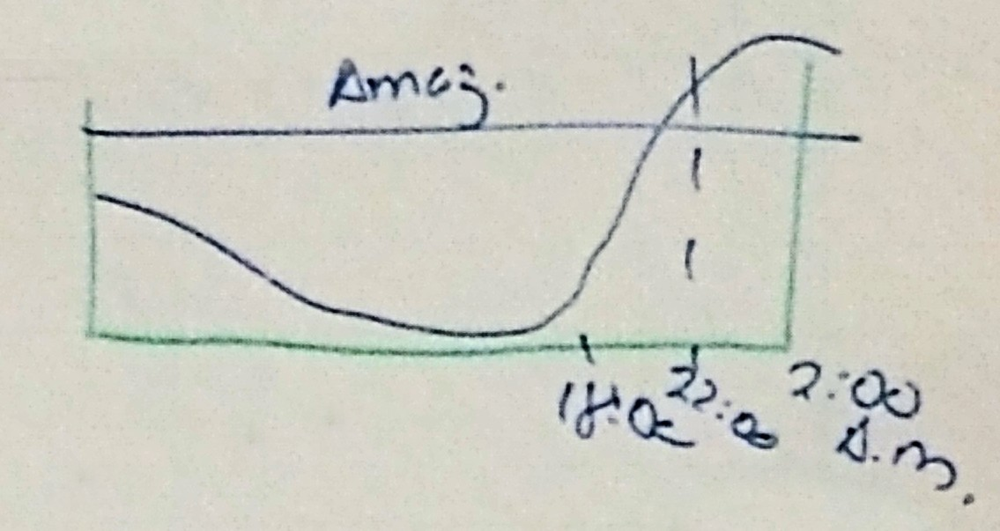

# Modelagem e avaliação de desempenho

> Agradecimentos ao [Felipe Megale](https://github.com/felipemegale) pelas imagens

## Sumário
* [Sumário](#sumário)
* [Introdução à modelagem e avaliação de desempenho de sistemas computacionais](#introdução-à-modelagem-e-avaliação-de-desempenho-de-sistemas-computacionais)
  * [Ciclo de vida de um sistema computacional](#ciclo-de-vida-de-um-sistema-computacional)
    * [1. Fase conceitual](#1-fase-conceitual)
    * [2. Fase de aquisição](#2-fase-de-aquisilção)
    * [3. Fase operacional](#3-fase-operacional)
    * [4. Fase de super-utilização](#4-fase-de-super-utilização)
  * [Aplicações da Metodologia para o planejamento de capacidade de sistemas computacionais](#aplicações-da-metodologia-para-o-planejamento-de-capacidade-de-sistemas-computacionais)
    * [1. Diagnóstico de servidores de aplicação](#1-diagnóstico-de-servidores-de-aplicação)
    * [2. Previsão de desempenho de sistemas virtuais de aprendizado](#2-previsão-de-desempenho-de-sistemas-virtuais-de-aprendizado)
    * [3. Em ambientes *leasing*](#3-em-ambientes-leasing)
    * [4. Sistemas de balanceamento de carga](#4-sistemas-de-balanceamento-de-carga)
    * [5. Modelando internamente cada servidor](#5-modelando-internamente-cada-servidor)
    * [6. Virtualização](#6-virtualização)
    * [7. Nuvens](#7-nuvens)
* [Metodologia para o planejamento de capacidade](#metodologia-para-o-planejamento-de-capacidade)
  * [Etapa 1: Diagnóstico inicial do desempenho do sistema](#etapa-1-diagnóstico-inicial-do-desempenho-do-sistema)
    * [1. Variáveis a serem observadas](#1-variáveis-a-serem-observadas)
    * [2. Horários para monitoramento](#2-horários-para-monitoramento)
    * [3. Tipos de monitores](#3-tipos-de-monitores)
    * [4. Tempo ode observação e amostragem](#4-tempo-ode-observação-e-amostragem)

## Introdução à modelagem e avaliação de desempenho de sistemas computacionais


A prática tem mostrado que frente a um baixo desempenho de sistemas computacionais (baixos níveis de QoS - Quality of Service) os maiores prejuízos financeiros ocorrem pela falta de uma mentalidade voltada para extrair o máximo benefício do investimento. Na prãtica, os responsáveis pelos setores de T.I. se apressam para propostas em mudanças de *hardware* sem mesmo ter esgotado todos os esforços para melhorar os níveis de QoS.


A Engenharia de Avaliação de Sistemas computacionais tem por objetivo, frente ao aumento contínuo da carga de trabalho, alimentar a vida útil do sistema, melhorando os níveis de serviço (R - tempo de resposta, U - utilização do sistema) dentro de limites normalmente estipulados pela gerência.

A engenharia de avaliação de desempenho de sistemas computacionais possui uma metodologia para o "planejamento de capacidade" a qual envolve uma série de etapas e ações, **corretivas** e **preventivas** que podem ser aplicadas ao longo do ciclo de vida do sistema.

Resumidamente essas ações podem ser sintetizadas nas seguintes:

* **Monitor:** Com quais dispositivos e durante quanto tempo?
* **Coletor:** Quais porâmetros observar objetivando a avaliação do sistema?
* **Sumarizar e identificar horãrios de pico**
* **Coletar novos dados:** Quais parâmetros coletar objetivando a otimização do sistema?
* **Selecionar os processos críticos:** Por onde começar a otimimza?
* **Otimizar:** Propor soluções para aumentar a vida útil e afastar a super-utilização
* **Meta-Otimização:** Tornar mais eficiente, provavelmente eficaz, o processo de otimização
* **Prever a carga de trabalho futuro:** Construção de modelos matemáticos
* **Modelar o sistema:** Construir modelos baseados na teoria das filas
* **Simular para prever o início da fase de super-utilização**
* **Configurar:** Propor configurações por meio de simulação
* **Negociar:** Fortes justificativas

### Ciclo de vida de um sistema computacional

Diferentemente ao ciclo de vida de um software, o ciclo de vida do sistema computacional não apresenta a "fase de morte". Qualquer mudança <u>parcial</u> ou <u>completa</u> da configuração de hardware é considerada evolução natural do sistema.


#### 1. Fase conceitual

Nesta fase, existe duas possíveis situações:

<ol type="a">
    <li>
        <b>Proposta da configuração inicial:</b> Para esta situação não existem técnicas altamente eficientes para configurar o hardware. As técnicas mais utilizadas são as técnicas Eu acho, Benchmark, Kernel.
    </li>
    <li>
        <b>Proposta de atualização deconfiguração existente:</b> Para esta situação existem técnicas mais elaboradas como a teoria das filas, simulação discreta, redes de petri, etc. Dentre estas a teoria das filas é mais aplicada para fins comerciais. Isso pelo tempo necessário para implementá-la.
    </li>
</ol>

#### 2. Fase de aquisição

Aparentemente esta fase parece transmitir uma impressão de simplicidade. Porém é exigido do responsável habilidades e estratégias de negociação e convencimento frente à diretoria e fornecedores. O resultado desta fase possui grandes implicações financeiras para a empresa. Isto torna-se mais sensível em ambientes onde predomina a compra de recursos e de sistemas _leasing_ (aluguel-venda). Neste último, existe maiores responsabilidade do responsável por acompanhar o desempenho do sistema.

Por exemplo, no sistema _leasing_:


Custo do aluguel: Por média ou por pico?

#### 3. Fase operacional

Espera-se que esta fase seja a mais longa de todas (2, 3 a 4 anos). Durante esta fase, o objetivo é extrair o máximo de proveito do investimento. Em outras palavras aumenta a vida últil do sistema, sem troca de configuração de _hardware_ (aumento de memória é permitido).


Durante a fase de operação são aplicadas as ações até a **Meta-otimização do sistema**. Ao final desta fase normalmente é realizada a previsão da carga de trabalho.

#### 4. Fase de super-utilização

Esta fase se caracteriza pelo fato da utilização do sistema estar em 100% de forma permanente. Esta fase deve ser previsa com 1 ano de antecedência. Na prática deve ser previsto com no mínimo 3 meses. Muitas vezes nos encontramos já na super-utilização.

### Aplicações da Metodologia para o planejamento de capacidade de sistemas computacionais

#### 1. Diagnóstico de servidores de aplicação

<table>
    <tr>
        <th></th>
        <th></th>
        <th>Antes</th>
        <th>Depois</th>
        <th></th>
    </tr>
    <tr>
        <td>🅧</td>
        <td><b>Memória (%)</b></td>
        <td>100</td>
        <td>98</td>
        <td></td>
    </tr>
    <tr>
        <td></td>
        <td><b>Paginação (%)</b></td>
        <td>35</td>
        <td>5</td>
        <td><i>Horário de pico<i></td>
    </tr>
    <tr>
        <td>🅧</td>
        <td><b>CPU (%)</b></td>
        <td>5</td>
        <td>5</td>
        <td></td>
    </tr>
</table>

#### 2. Previsão de desempenho de sistemas virtuais de aprendizado

Foram identificados: 80 requisições distintas
Modelos do sistema: 80 equações

Para simplificar o modelo:
* Eliminação de processos obsoletos e irrelevantes
* Redução de processos pela similaridade de características

**Exempo:**
```
Saldo Conta Corrente ≡ Saldo Polpança
Modelo resultante: 5 equações
```
#### 3. Em ambientes *leasing*


#### 4. Sistemas de balanceamento de carga


##### Critérios

1. Envia para o servidor com menor carga;
2. Tempo de resposta no instante `t`;
3. Utilização dos servidores;
4. Disponibilidade.


#### 5. Modelando internamente cada servidor

**Lei do fluxo forçado**


#### 6. Virtualização


#### 7. Nuvens


## Metodologia para o planejamento de capacidade

A metodologia para o planejamento de capacidade possui uma série de etapas com ações tanto **corretivas** como **preventivas**. A aplicação desta metodologia procura melhorar o desempenho do sistema, aumento da vida útil do sistema dentro dos padrões de qualidade previamente estipulados.

### Etapa 1: Diagnóstico inicial do desempenho do sistema

Durante esta etapa é necessário responder às seguintes questões:

1. Quais variáveis monitorar?
2. Quando monitorar?
3. Com quais tipos de monitores devemos monitorar?
4. Durante quanto tempo devemos monitorar?
5. De quanto em quanto tempo devemos coletar?
6. Como sintetizar?
7. Como visualizar?

#### 1. Variáveis a serem observadas

| Variável | Descrição | Unidade |
|-|-|-|
| λ | Requisições que chegam | requisições por segundo |
| R | Tempo médio de resposta | segundos por requisição |
| Ui | Utilização da CPU (processamento) | porcentagem |
| Du | Disponibilidade do sistema | |
| M | Consumo de memória | porcentagem |
| Pag | Paginação | porcentagem |

#### 2. Horários para monitoramento

É altamente aconselhável realizar o monitoramento durante o horário de pico. Caso esse horário não seja previamente definido podem ser executadas as seguintes ações:

1. Coleta de dados durante 1 semana
2. Excepcionalmente durante 1 dia
3. Em teoria durante 1 ano

É possível também considerar o próprio experiência.

Por exemplo:
* Setor financeiro:
````
P1: 11:00 - 13:00
P2: 16:00 - 20:00
````
* Setor eComerce:
  * Lojas Americanas:


#### 3. Tipos de monitores

Os monitores mais utilizados comercialmente correspondem aos monitores de software, os quais ficam residentes em memória observando todas as interrupções (instruções) do sistema.

Esses monitores consomem memória, CPU, disco e possuem impacto no desempenho do sistema. Existem 2 modalidades:

1. **RMF:** Monitores orientados a <u>eventos</u>. Altamente precisos, porém com grande impacto no desempenho atual do sistema. devem ser evitados quando o sistema é crítico. Estes podem chegar a impactar até 15%.

2. **SMF:** Orientado a amostragem. O sistema é observado de tempos em tempos. São mais imprecisos e redundantes. Comercialmente mais utilizados.


#### 4. Tempo ode observação e amostragem

Para monitores na modalidade SMF 2 parâmetros devem ser ajustados:

```
T₀: Tempo de observação
Tₛ: Tempo de amostragem
```
O ajuste desses parâmetros dependem dos objetivos:

1. **Para o diagnóstico:** Não existe fortes restrições para ajustar o `T₀` e `Tₛ`.
  * **Exemplo:**
```
T₀ = 30 min, 1h
Tₛ = 2, 3 até 5h

// Observação: Procurar respeitar a Hipótese do Equilíbrio de Fluxo
```