# Modelagem e avaliação de desempenho

> Agradecimentos ao [Felipe Megale](https://github.com/felipemegale) e [Otto Bittencourt](https://github.com/OttoWBitt) pelas imagens

## Introdução à modelagem e avaliação de desempenho de sistemas computacionais


A prática tem mostrado que frente a um baixo desempenho de sistemas computacionais (baixos níveis de QoS - Quality of Service) os maiores prejuízos financeiros ocorrem pela falta de uma mentalidade voltada para extrair o máximo benefício do investimento. Na prãtica, os responsáveis pelos setores de T.I. se apressam para propostas em mudanças de *hardware* sem mesmo ter esgotado todos os esforços para melhorar os níveis de QoS.


A Engenharia de Avaliação de Sistemas computacionais tem por objetivo, frente ao aumento contínuo da carga de trabalho, alimentar a vida útil do sistema, melhorando os níveis de serviço (R - tempo de resposta, U - utilização do sistema) dentro de limites normalmente estipulados pela gerência.

A engenharia de avaliação de desempenho de sistemas computacionais possui uma metodologia para o "planejamento de capacidade" a qual envolve uma série de etapas e ações, **corretivas** e **preventivas** que podem ser aplicadas ao longo do ciclo de vida do sistema.

Resumidamente essas ações podem ser sintetizadas nas seguintes:

* **Monitor:** Com quais dispositivos e durante quanto tempo?
* **Coletor:** Quais porâmetros observar objetivando a avaliação do sistema?
* **Sumarizar e identificar horãrios de pico**
* **Coletar novos dados:** Quais parâmetros coletar objetivando a otimização do sistema?
* **Selecionar os processos críticos:** Por onde começar a otimimza?
* **Otimizar:** Propor soluções para aumentar a vida útil e afastar a super-utilização
* **Meta-Otimização:** Tornar mais eficiente, provavelmente eficaz, o processo de otimização
* **Prever a carga de trabalho futuro:** Construção de modelos matemáticos
* **Modelar o sistema:** Construir modelos baseados na teoria das filas
* **Simular para prever o início da fase de super-utilização**
* **Configurar:** Propor configurações por meio de simulação
* **Negociar:** Fortes justificativas

### Ciclo de vida de um sistema computacional

Diferentemente ao ciclo de vida de um software, o ciclo de vida do sistema computacional não apresenta a "fase de morte". Qualquer mudança <u>parcial</u> ou <u>completa</u> da configuração de hardware é considerada evolução natural do sistema.


#### 1. Fase conceitual

Nesta fase, existe duas possíveis situações:

<ol type="a">
    <li>
        <b>Proposta da configuração inicial:</b> Para esta situação não existem técnicas altamente eficientes para configurar o hardware. As técnicas mais utilizadas são as técnicas Eu acho, Benchmark, Kernel.
    </li>
    <li>
        <b>Proposta de atualização deconfiguração existente:</b> Para esta situação existem técnicas mais elaboradas como a teoria das filas, simulação discreta, redes de petri, etc. Dentre estas a teoria das filas é mais aplicada para fins comerciais. Isso pelo tempo necessário para implementá-la.
    </li>
</ol>

#### 2. Fase de aquisição

Aparentemente esta fase parece transmitir uma impressão de simplicidade. Porém é exigido do responsável habilidades e estratégias de negociação e convencimento frente à diretoria e fornecedores. O resultado desta fase possui grandes implicações financeiras para a empresa. Isto torna-se mais sensível em ambientes onde predomina a compra de recursos e de sistemas _leasing_ (aluguel-venda). Neste último, existe maiores responsabilidade do responsável por acompanhar o desempenho do sistema.

Por exemplo, no sistema _leasing_:


Custo do aluguel: Por média ou por pico?

#### 3. Fase operacional

Espera-se que esta fase seja a mais longa de todas (2, 3 a 4 anos). Durante esta fase, o objetivo é extrair o máximo de proveito do investimento. Em outras palavras aumenta a vida últil do sistema, sem troca de configuração de _hardware_ (aumento de memória é permitido).


Durante a fase de operação são aplicadas as ações até a **Meta-otimização do sistema**. Ao final desta fase normalmente é realizada a previsão da carga de trabalho.

#### 4. Fase de super-utilização

Esta fase se caracteriza pelo fato da utilização do sistema estar em 100% de forma permanente. Esta fase deve ser previsa com 1 ano de antecedência. Na prática deve ser previsto com no mínimo 3 meses. Muitas vezes nos encontramos já na super-utilização.

### Aplicações da Metodologia para o planejamento de capacidade de sistemas computacionais

#### 1. Diagnóstico de servidores de aplicação

|    |                   | Antes | Depois |                   |
|----|-------------------|:-----:|:------:|-------------------|
| ❌ | **Memória (%)**   |   100 |     98 |                   |
|    | **Paginação (%)** |    35 |      5 | _Horário de pico_ |
| ❌ | **CPU (%)**       |     5 |      5 |                   |

#### 2. Previsão de desempenho de sistemas virtuais de aprendizado

Foram identificados: 80 requisições distintas
Modelos do sistema: 80 equações

Para simplificar o modelo:

* Eliminação de processos obsoletos e irrelevantes
* Redução de processos pela similaridade de características

**Exempo:**

```text
Saldo Conta Corrente ≡ Saldo Poupança
Modelo resultante: 5 equações
```

#### 3. Em ambientes *leasing*


#### 4. Sistemas de balanceamento de carga


##### Critérios

1. Envia para o servidor com menor carga;
2. Tempo de resposta no instante `t`;
3. Utilização dos servidores;
4. Disponibilidade.


#### 5. Modelando internamente cada servidor

##### Lei do fluxo forçado


#### 6. Virtualização


#### 7. Nuvens


## Metodologia para o planejamento de capacidade

A metodologia para o planejamento de capacidade possui uma série de etapas com ações tanto **corretivas** como **preventivas**. A aplicação desta metodologia procura melhorar o desempenho do sistema, aumento da vida útil do sistema dentro dos padrões de qualidade previamente estipulados.

### Etapa 1: Diagnóstico inicial do desempenho do sistema

Durante esta etapa é necessário responder às seguintes questões:

1. Quais variáveis monitorar?
2. Quando monitorar?
3. Com quais tipos de monitores devemos monitorar?
4. Durante quanto tempo devemos monitorar?
5. De quanto em quanto tempo devemos coletar?
6. Como sintetizar?
7. Como visualizar?

#### 1. Variáveis a serem observadas

| Variável | Descrição | Unidade |
|-|-|-|
| λ | Requisições que chegam | requisições por segundo |
| R | Tempo médio de resposta | segundos por requisição |
| Ui | Utilização da CPU (processamento) | porcentagem |
| Du | Disponibilidade do sistema | |
| M | Consumo de memória | porcentagem |
| Pag | Paginação | porcentagem |

#### 2. Horários para monitoramento

É altamente aconselhável realizar o monitoramento durante o horário de pico. Caso esse horário não seja previamente definido podem ser executadas as seguintes ações:

1. Coleta de dados durante 1 semana
2. Excepcionalmente durante 1 dia
3. Em teoria durante 1 ano

É possível também considerar o próprio experiência.

Por exemplo:

* Setor financeiro:

    ```text
    P1: 11:00 - 13:00
    P2: 16:00 - 20:00
    ```

* Setor eComerce:
  * Lojas Americanas:


#### 3. Tipos de monitores

Os monitores mais utilizados comercialmente correspondem aos monitores de software, os quais ficam residentes em memória observando todas as interrupções (instruções) do sistema.

Esses monitores consomem memória, CPU, disco e possuem impacto no desempenho do sistema. Existem 2 modalidades:

1. **RMF:** Monitores orientados a <u>eventos</u>. Altamente precisos, porém com grande impacto no desempenho atual do sistema. devem ser evitados quando o sistema é crítico. Estes podem chegar a impactar até 15%.

2. **SMF:** Orientado a amostragem. O sistema é observado de tempos em tempos. São mais imprecisos e redundantes. Comercialmente mais utilizados.


#### 4. Tempo de observação e amostragem

Para monitores na modalidade SMF 2 parâmetros devem ser ajustados:

```text
T₀: Tempo de observação
Tₛ: Tempo de amostragem
```

O ajuste desses parâmetros dependem dos objetivos.

Para o diagnóstico não existe fortes restrições para ajustar o `T₀` e `Tₛ`.

**Exemplo:**

```text
T₀ = 30 min, 1h
Tₛ = 2, 3 até 5h

// Observação: Procurar respeitar a Hipótese do Equilíbrio de Fluxo
```

1. Objetivo é o diagnóstico

    ```text
    T₀ = não há restrições
    Tₛ = 2 a 5 segundos (recomenda-se 3 segundos)

    // Observação: Procurar respeitar a Hipótese do Equilíbrio de Fluxo
    ```

2. Objetivo é a modelagem

    ```text
    T₀ = não é possível definir a priori
    Tₛ = não é possível definir a priori

    // Condições: Respeitar a Hipótese do Equilíbrio de Fluxo e das transições unitárias
    ```

#### 5. Visualização de dados para avaliação de desempenho

É recomendado a construção de gráficos de valores médios de consumo ao longo das semanas e/ou meses. Referências menores à semana, por dia, não é interessante, pois mostra excessiva variabilidade. O objetivo é observar tendências.

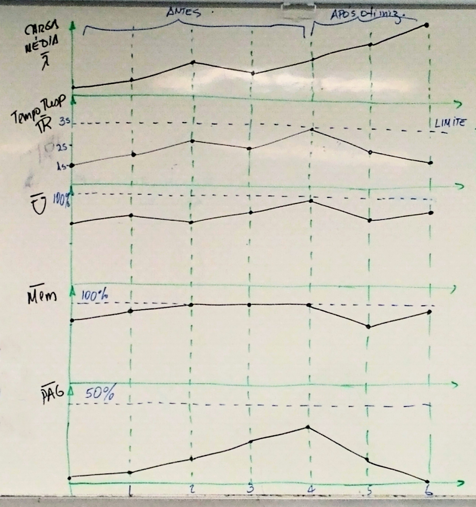


**Observações:**

1. Batch aumenta ➡️ Online diminui
2. Batch próximo de 100%
3. Online abaixo do batch
4. Não existem variações abruptas
5. Pouca permanência em condição de alto consumo
6. Sistema estável, sem variações significativas

### Etapa 2: Identificação do horário de pico

De forma a ser eficientes na melhoria do desempenho do sistema os esforços de otimização devem estar concentrados durante o(s) horário(s) de pico. Daí é imperativo identificar esses horários.

Para isto, deve ser feita uma coleta do consumo do processador ao longo de 1 ano, 24 horas, por dia. A ideia é identificar:

* Mês mais crítico
* Semana mais crítica
* Dia da semana mais crítico
* Período do dia mais crítico

**Procedimentos**

1. Definir

    ```text
    T₀ = 365 dias x 24 horas
    Tₛ = 3 segundos
    ```

2. Definir períodos do dia

    **Exemplo:**

    ```text
    P₁ 08:00 - 10:00
    P₂ 10:01 - 12:00
    P₃ 12:10 - 18:00
    P₄ 18:01 - 07:59
    ```


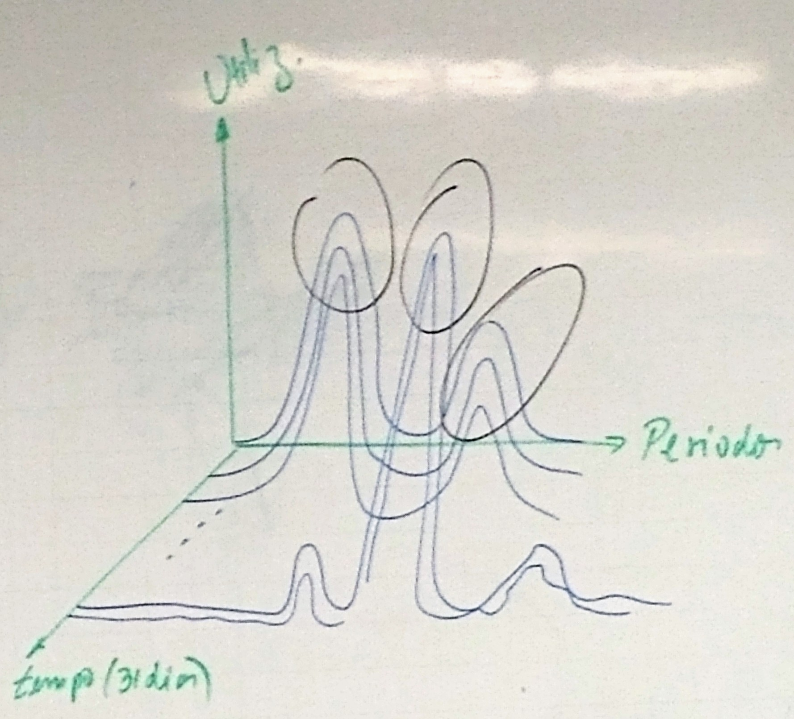

### Etapa 3: Coleta de dados acerca do consumo de recursos por processos

Após a identificação do(s) horário(s) de pico do sistema, o próximo passo é realizar uma nova coleta do consumo de recursos por cada processo sendo executado nesses horários. O objetivo é podermos identificar processos críticos e tornar o processo de otimização mais efetivo.

Durante a coleta, devem ser consideradas duas classes de variáveis:

| Qualitativas               | Quantitativas                        |
|----------------------------|--------------------------------------|
| Otimizações                | Meta otimização                      |
| ID de processos            | Número de execuções                  |
| Sistema Job vinculado      | Horas de CPU gasto (total, médio)    |
| Horário de disponibilidade | Consumo médio de memória/execução    |
| Horário de finalização     | Nível médio de paginação             |
| Job Batch/Online           | Número de I/O em disco                |
|                            | Tempo total gasto de acesso ao disco |

> **Observação:** Dados coletados durante o horário de pico

### Etapa 4: Seleção de processo crítico

De forma a tomar o processo de otimização mais eficiente, é interessante comelar pelos processos mais críticos, deixando por último os de menor impacto.

É importante ressaltar que esses critérios são uma recomendação. em outras palavras, todos os processos devem ser analizados e otimizados se possível.

| CPU | Memória | Número de execuções | I/O | Tempo |
|:---:|:-------:|:-------------------:|:---:|:-----:|
| ➕   | ➕       | ➕                   | ➕   | ➕     |
| ➕   | ➕       |                     |     |       |
|     | ➕       | ➕                   | ➕   | ➕     |
|     |         | ➕                   | ➕   | ➕     |
|     |         |                     | ➕   | ➕     |
|     |         | ➕                   |     |       |

> Sugestão de ordem de observação

### Etapa 5: Otimização do sistema

Após as identificações dos processos críticos, a próxima etapa é a proposta de soluções de otimizações dentre as ações:

#### 1. Diminuir as portas de acesso ao sistema

Esta não é otimização, somente melhora pleativamente o desempenho

#### 2. Recodificação de programas

É uma alternativa quando as aplicações demandam principalmente de códigos de programa. Possui pouco impacto no melhoramento da performace.

#### 3. Escalonamento adequado do sistema

Na prática esta ação é a mais aplicada na busca do melhoramento do sistema. Consistem em movimentar jobs (não requisições do ambiente online) para outros horários menos críticos. Altamente eficiente, mas com dificuldades de implementação:

* Exige mudanças culturais das rotinas administrativas do negócio
* Pode existir limitações para a movimentação em outros horários. O ideal seria para horários batch (noturno). Na prática a movimentação pode afetar outros horários de pico.
* Para aplicar racionalmente, e ser eficiente, a técnica do escalonamento será mais efetiva se tivermos uma ideia clara de todos os horários de pico da instalação. Caso esses horários não sejam conhecidos, somente após 1 ano podemos alcançar a sua efetividade.

A otimização por escalonamento de serviços possui 2 principais aplicações:

1. Partindo do princípio que não é possível otimizar o "caos", o escalonamento ajuda na programação das rotinas de execução diária dos diversos processos. Notemos que outras ações corretivas podem ser aplicadas durante a aplicação da técnica de escalonamento.

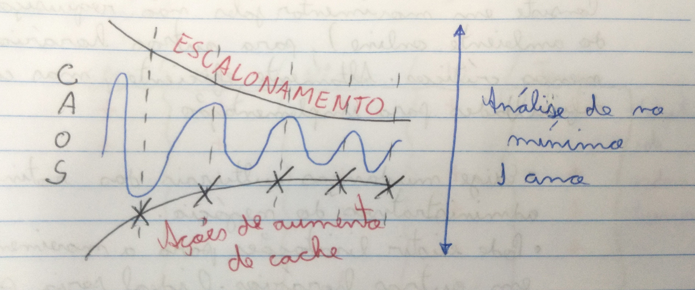

2. Somente após o escalonamento é possível modelar o sistema e propor novas configurações.

##### Otimização pós-escalonamento


Como mencionado, o processo de escalonamento é uma ação bastante efetiva para melhoramento do desempenho do sistema. O objetivo do planejamento é programar a execução de jobs ao longo do dia.

Em sistemas operacionais, virtual machine, existem tecnologias para auxiliar no planejamento **controlado** de execuções de processos.


##### Otimização de disco

Em sistemas corporativos, as bases de dados não são armazenadas permanentemente em disco. Isto por dois motivos: custos altos e segurança fisica. Muitas bases de dados são armazenadas em fita e dispitam espaço nos discos, o que leva ao aumento da atividade de I/O em disco deteriorando o desempenho global do sistema.


###### a) Reduzindo o numero de operações de I/O em disco

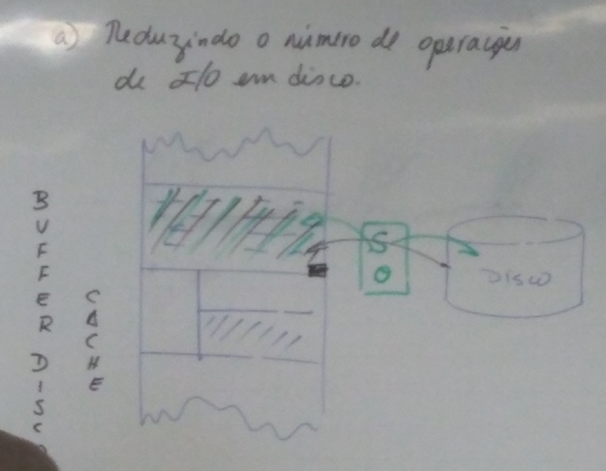


**Modelo ideal**


> **Observação:** O modelo de organização ideal deve levar em conta:
>
> * O tamanho e a frequência de acesso ao arquivo de dados

**Buffer maiores:** Grandes com grandes frequências
**Buffer menores:** Grandes arquivos com pouquíssima frequência (esta situação pode indicar acesso direto ao registro em disco, por meio de código em Assembly)

> **Observação:** O objetivo é encontrar o tamanho de buffer ideal

Em sistemas operacionais virtual machine é possível ajustar o buffer de disco sob demanda, durante uma seção que pode caracteriar a execução de um Job.

Os sistemas operacionais virtuais fornecem uma formula para ajustar o tamanho do bloco:

```text
FB = sizeOfRecord * numberOfRecords
```

**Exemplo:**

```text
sizeOfRecord = 1000B
numberOfRecords = 100
FB = 100000B
```

Notemos que podemos ajustar o FB sem cálculo

```text
FB = 110000B
```

###### b) Técnica de cilindro para redução do tempo de movimento do braço

Em sistemas virtual machine é possível utilizar a técnica de discos em cilindro. É a melhor técnica para diminuir a operação de disco.


###### c) Redução do nível de fragmentação de disco

Na prática os discos são recursos escassos. Qualquer organização armazena permanentemente seus arquivos em fita. Por esse motivo quando arquivos (base de dados) precisam de acesso aleatório o arquivo deve ser baixado para disco e dessa forma o arquivo compete por espaço com outros arquivos. Isto aumenta o nível de fragmentação.


### Etapa 6: Meta-otimização

Tipicamente durante o horário de pico de uma instituição, por exemplo, financeira, possui de 300 a 400 distintos sendo executados. Em bancos digitais esse número pode chegar até 600 processos.

Sendo o objetivo otimizar o sistema de forma rápida e eficiente, pode levaer muito tempo para atingir uma condição ótima de funcionamento.

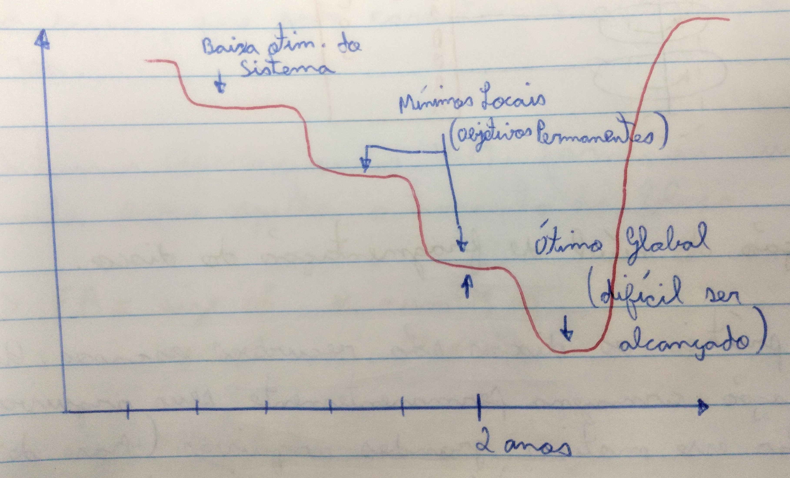

Então é sugerido replicar algumas ações aplicadas a certos procesos para outros processos semelhantes.

Esse procedimento não garante a eficácia, porem é eficiente na direção da otimização global. Não são todas as ações que podem ser replicadas.

Por exemplo:

* Recodificação do código ❌
* Escalonamento de serviços ❌
* Definição de fator de bloco (Diminui o número de I/O) ✔
* Reorganização de arquivos em disco ✔

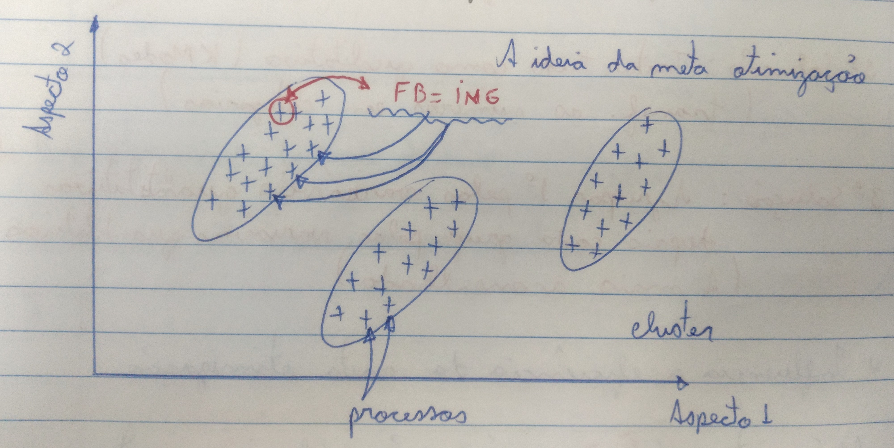

**Procedimentos**

Para cada processo devemos considerar aspectos quantitativos e qualitativos.

```text
Px = {
    Variáveis qualitativas,
    Variáveis quantitativas
}

Px = {
    Sistema ao qual o processo está vinculado,
    Tempo que fica disponível o processo,
    Turno de disponibilidade,
    Consumo de CPU,
    Consumo de memória,
    Número de I/O,
    Nível de paginação
}
```

* 1ª solução*: Tratar tudo como quantitativo (K-means)
    * Transformar as categorias em números
* 2ª solução*: Tratar tudo como qualitativo (K-modes)
    * Transformar os números em categorias
* 3ª solução*: Agrupar 1ª pelas variáveis qualitativas depois cada grupo pelas variáveis quantitativas
    * A mais aconselhada

> *Influência a eficiência da meta-otimização

Até a etapa 6, as ações são exclusivamente **corretivas**, mas uma metodologia para o planejamento de capacidade deve propor ações para o futuro desempenho.

### Etapa 7: Estimativa de carga futura de trabalho

Uma etapa essencial para avaliar o desempenho futuro de um sistema é prver a carga de trabalho futura. Normalmente são aplicados modelos de regressão.

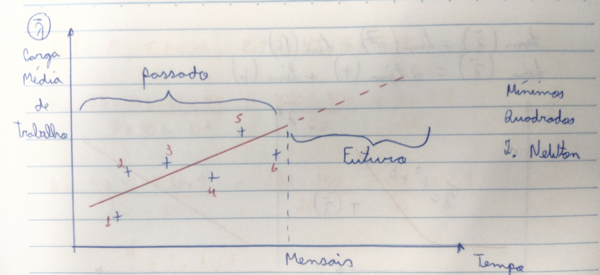

> **Observação:** Para determinar horário de pico

#### Problemas de erros de previsão

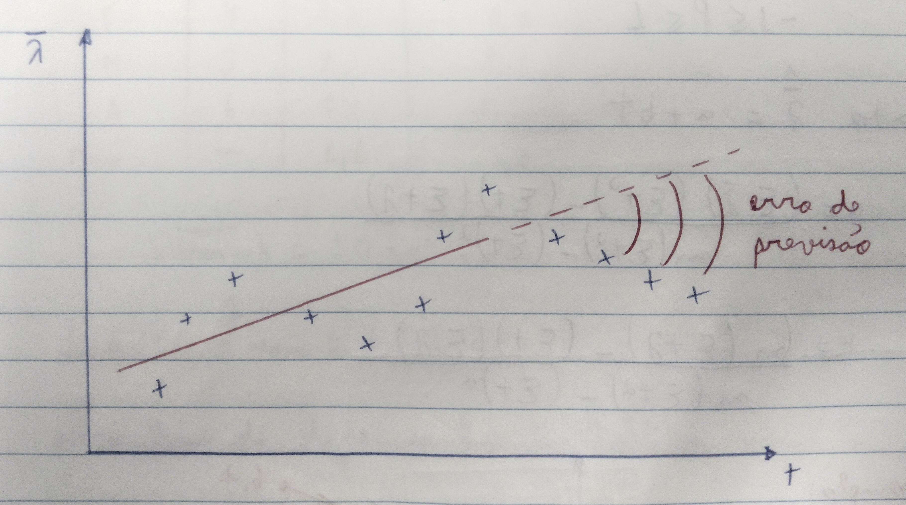

> **Observação:** Até quando aplicar um modelo de regressão linear

#### Algumas possíveis soluções

```text
λ-médio = t² + b

lim(λ-médio) = lim(t²) + lim(b)
lim(λ-médio) = 2 * lim(t) + lim(b)
```

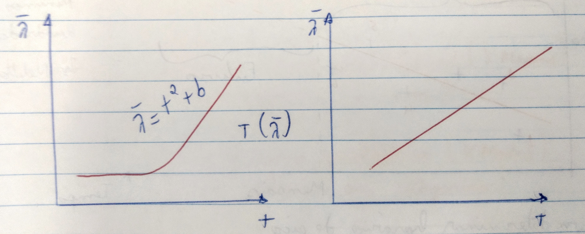

##### Pearson

```text
-1 <= P <= 1
```

Dado `λ-estimado = a + (b * t)`

```text
a = (sum(λ-médio) * sum(t²) - sum(t) * sum(t * λ)) / (m * sum(t²) - sum(t)²)

b = (m * sum(t * λ) - sum(t) * sum(λ)) / (m * sum(t²) - sum(t)²)
```

**Exemplo:**
| Mês | `λ-médio` |
|-|:-:|
| Janeiro | 2 |
| Fevereiro | 4 |
| Março | 3 |
| Abril | 6 |

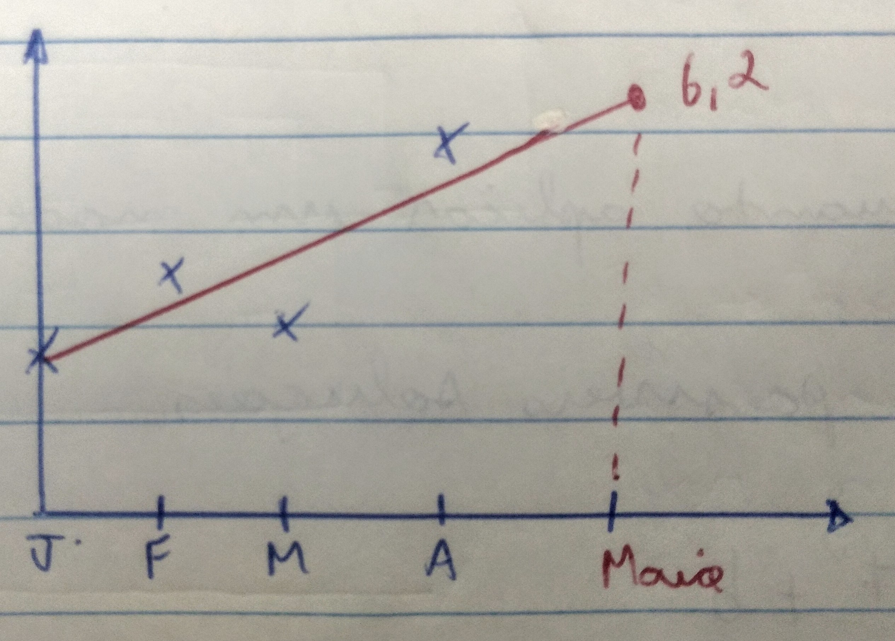

```text
sum(λ-médio) = 15
sum(t) = 10
sum(t * λ) = 41
sum(t²) = 30

a = (15 * 30 - 10 * 43) / (4 * 30 - 10²)
  = (450 - 430) / 20
  = 20 / 20
  = 1

b = (4 * 43 - 10 * 5) / (120 - 100)
  = (172 - 150) / 20
  = 22 / 20
  = 1,1

λ-estimado = 1 + 1,1 * t
```

| Mês       | `λ-médio` | `λ-estimado` | `|erro|` |
|-----------|:---------:|:------------:|:--------:|
| Janeiro   |         2 |          2,1 |      0,1 |
| Fevereiro |         4 |          3,2 |      0,8 |
| Março     |         3 |          4,3 |      1,3 |
| Abril     |         6 |          5,4 |      0,6 |
| Maio      |         - |          6,6 |      2,8 |

```text
|erro| = ±0,7
```

Logo:

```text
λ-estimado = 6,6 ± 0,7
```

para funs de desempenho:

```text
λ-estimado = 7,3
```

### Etapa 8: Modelagem do sistema computacional

A modelagem do sistema computacional deve ser iniciada quando for alcançado um correto escalonamento de serviços. Isto pelo fato dos modelos possuírem tantas equações como distintos processos sendo executados num determinado horário. Daí para utilizar o modelo para fim de previsão é necessário garantir que a natureza da carga é a mesma.


`Di`: Tempo total gasto por uma requisição no dispositivo `i` sem considerar tempo de espera.
`Ui`: Utilização do dispositivo `i`
`R`: Tempo médio por requisição (segundos/requisição)

```text
Di = Ui / X0, X0 = requisições/segundo
```

**Exemplo:**

```text
T0 = 1h
C0 = Concluída 7200 requisições
Ucpu = 60%
Ud1 = 50%
Ud2 = 80%
Ud3 = 90%

R = ((0.6 / 2) / (1 - 0.6))
  + ((0.5 / 2) / (1 - 0.5))
  + ((0.8 / 2) / (1 - 0.8))
  + ((0.9 / 2) / (1 - 0.9))
// Simplificando
R = 0.75 + 0.5 + 2 + 4.5
R = 7.75 segundos/requisição
```

**Exemplo (aumentando a carga em 10%):**

```text
R = (0.3  / (1 - 0.66))
  + (0.25 / (1 - 0.55))
  + (0.4  / (1 - 0.88))
  + (0.45 / (1 - 0.99))
// Simplificando
R = 0.88 + 0.55 + 3.33 + 45
R = 49.76 segundos/requisição
```

**Exemplo (melhorando o código):**

```text
R = (0.3 * 0.9  / (1 - (0.66 * 0.9)))
  + 0.55
  + 3.33
  + 45
// Simplificando
R = 0.66 + 0.55 + 3.33 + 45
R = 49.54 segundos/requisição
```

### Etapa 9: Previsão do surgimento da fase de super-utilização

Tendo construído modelos para a carga de trabalho e do sistema computacional, esta etapa propõe prever o início da fase de super-utilização.

A fase de super-utiliação se caracteriza pelo fato de terminas alcançado a saturação do sistema (100% de utilização do processador) kde forma permanente.

O termo permanente é um termo relativo e depende da finalidade do sistema computacional.

Por exemplo:

* Em sistemas de e-commerce
  * Permanente: Saturado acima de 10% do horário de pico.
    * Se horário de pico: 12:00 - 13:00
    * "Permanente" > 6 min
* Em sistemas acadêmicos
  * Permanente: Saturado acima de 60% do horário de pico
    * Se horário de pico: 12:00 - 13:00
    * "Permanente" > 36 min

É sugerido que a super-utilização seja prevista com 1 ano de antecedência, porém na prática ocorre 4 a 6 meses. Muitos sistemas já vivem na fase de super-utilização.

#### Como determinar o tempo para a fase de super-utilização?

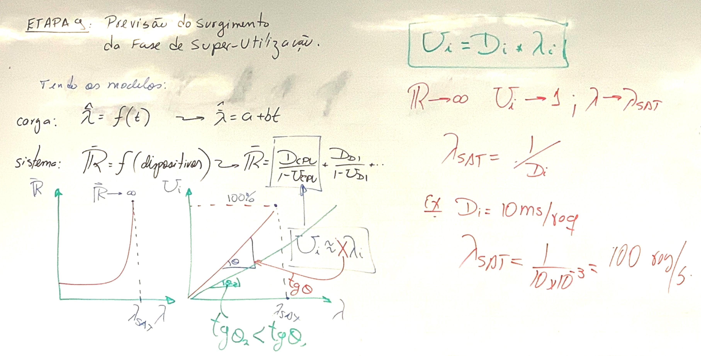

#### Quando vai acontecer?

```text
λ-médio = λ-sat = a + b * t
t-sat = (λ-sat - a) / b
```

**Tempo até `λ-sat` ocorrer:**

```text
tempo = t-sat - hist. meses
```

**Exemplo:**


### Etapa 10: Proposta da nova configuração

Considerando os modelos de carga de trabalho e do sistema, o próximo passo é ajustar uma configuração que atenda requisitos como:

* Vida útil do sistema
* Disponibilidade do sistema
* Limites de QoS


### Etapa 11: Negociação com diretoria e fornecedores

Após obtenção de configuração ideal a próxima etapa procura a negociação com a diretoria e os fornecedores de forma a adquirir a nova configuração.

Esta etapa, aparentemente a menos relevante, possui grande impacto financeiro, especialmente quando aplica sistemas *leasing* ou de aluguel de recursos.


Nesta etapa é necessário o convencimento que a troca de hardware é necessária.


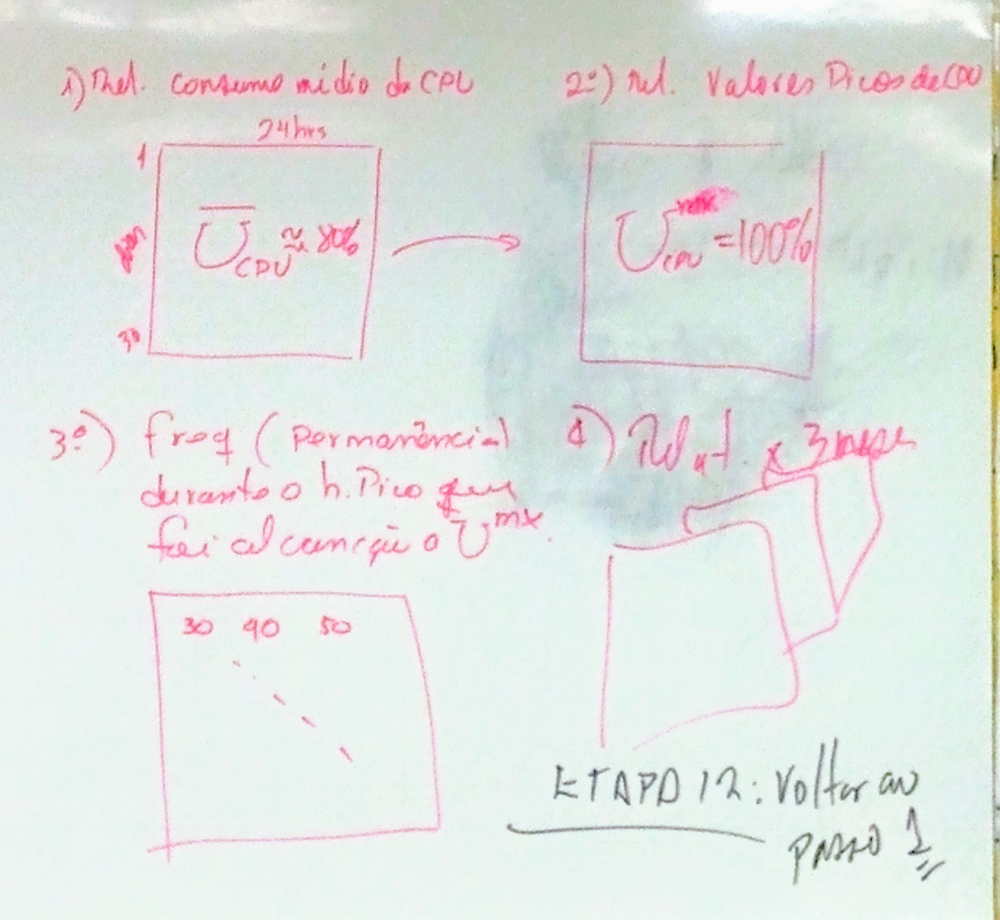

### Etapa 12: Voltar ao passo 1
