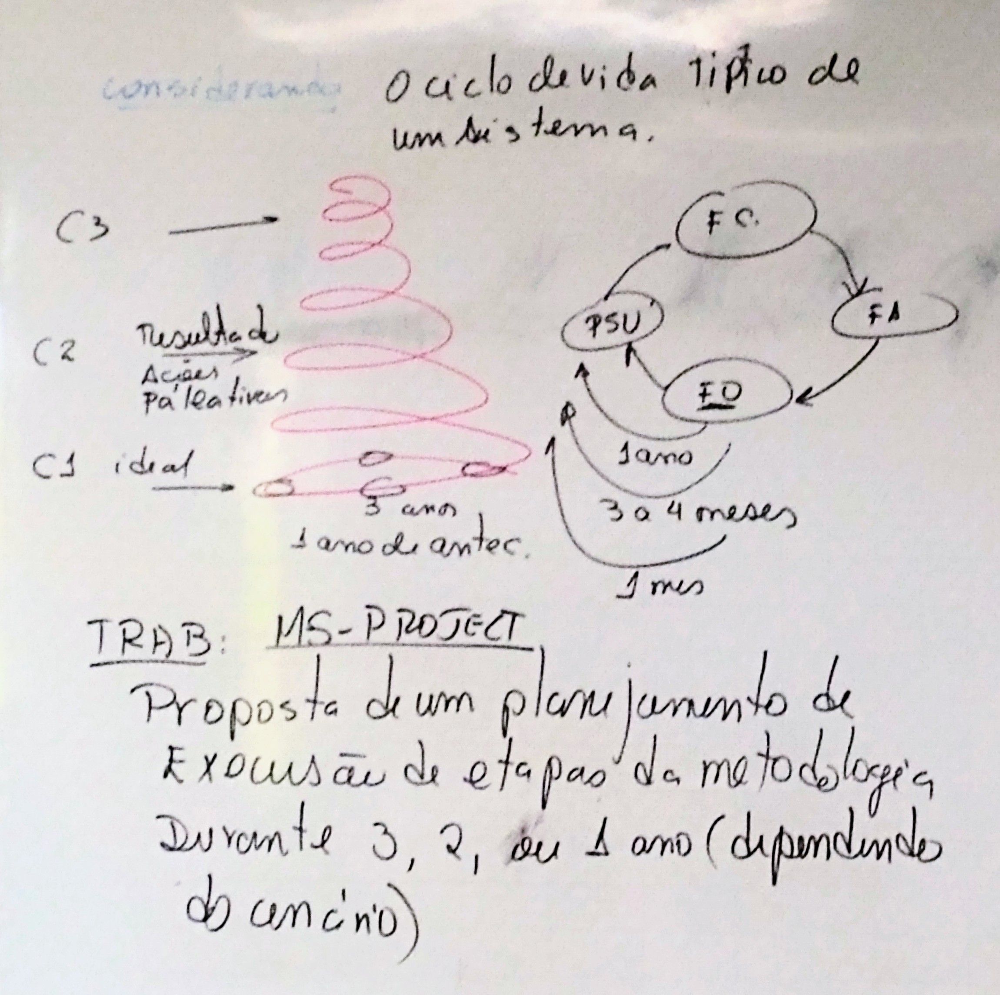

# Trabalho 1

Considerando o ciclo de vida típico de um sistema.

## O que deve ser feito

Proposta de um planejamento de execução de etapas da metodologia durante 3, 2 ou 1 ano (dependendo do cenário)

## Onde deve ser feito

[MS-Project](https://products.office.com/pt-br/project/project-and-portfolio-management-software)

## Grupos

| | Integrantes | Cenário |
|-|:-|:-:|
| Grupo 1 | <ul><li>Luigi Doménico</li><li>Gabriel Luciano</li><li>Giovane Fonseca</li><li>Paulo Júnior</li> | 3 |
| Grupo 2 | <ul><li>Cora</li><li>Felipe </li><li>Gustavo Araújo</li><li>Octávio</li> | 2 |
| Grupo 3 | <ul><li>Guilherme</li><li>Fábio</li><li>Gustavo Henrique</li><li>Rafael</li> | 1 |
| Grupo 4 | <ul><li>Federico</li><li>Giovanna</li><li>Ana Letícia</li><li>Augusto</li> | 3 |
| Grupo 5 | <ul><li>Bruno</li><li>Carlos</li><li>Kymberlly</li><li>Vitor Nunes</li> | 2 |
| Grupo 6 | <ul><li>Guilherme Afonso</li><li>Tiago</li><li>Fernando</li><li>Artur</li> | 1 |
| Grupo 7 | <ul><li>Guilherme Galvão</li><li>João Paulo</li><li>Pedro</li> | 3 |
| Grupo 8 | <ul><li>Rafael Câmara</li><li>Otto</li><li>Filipe</li><li>Ana</li> | 2 |